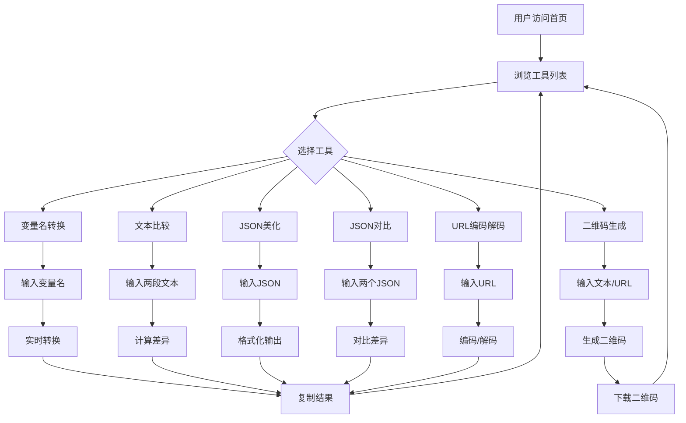

## 1. 产品概述

檬橙IT工具箱是一款面向IT开发者和设计师的实用工具集合，提供变量名转换、文本比较、JSON美化格式化、JSON对比、二维码生成等功能，帮助用户提升日常开发效率。

- **目标用户**: 前端开发工程师、后端开发工程师、产品经理、UI设计师
- **核心价值**: 一站式解决开发过程中的常见文本处理需求，提高工作效率

## 2. 核心功能

### 2.1 用户角色
| 角色 | 注册方式 | 核心权限 |
|------|----------|----------|
| 普通用户 | 无需注册 | 使用所有工具功能 |

### 2.2 功能模块
1. **变量名转换**: 支持驼峰、下划线、中划线、帕斯卡等多种命名风格互转
2. **文本比较**: 对比两段文本的差异，高亮显示不同之处
3. **JSON美化**: 将压缩的JSON格式化为易读的缩进格式
4. **JSON对比**: 对比两个JSON对象的差异，支持嵌套结构
5. **二维码生成**: 将文本/URL转换为二维码图片，支持自定义大小和颜色
6. **URL编码解码**: 对URL进行编码和解码操作

### 2.3 页面详情
| 页面名称 | 模块名称 | 功能描述 |
|----------|----------|----------|
| 首页 | 导航栏 | 工具分类导航、搜索功能、主题切换 |
| 首页 | 功能卡片 | 展示所有工具入口，带图标和描述 |
| 变量名转换 | 输入区域 | 支持直接输入或粘贴变量名 |
| 变量名转换 | 输出区域 | 实时展示多种命名风格的转换结果 |
| 变量名转换 | 快捷操作 | 一键复制、清空输入 |
| 文本比较 | 双输入区域 | 左右分栏输入两段待比较文本 |
| 文本比较 | 结果区域 | 高亮显示差异，支持行号对照 |
| JSON美化 | 输入区域 | 支持粘贴压缩的JSON文本 |
| JSON美化 | 输出区域 | 格式化后的JSON，带语法高亮 |
| JSON美化 | 格式化选项 | 缩进空格数、是否排序键 |
| JSON对比 | 双输入区域 | 左右分栏输入两个JSON |
| JSON对比 | 结果区域 | 可视化展示差异，新增/修改/删除标记 |
| 二维码生成 | 输入区域 | 输入文本或URL |
| 二维码生成 | 预览区域 | 实时预览二维码效果 |
| 二维码生成 | 自定义选项 | 尺寸、颜色、边距设置 |
| URL编码解码 | 输入区域 | 输入URL或编码后的文本 |
| URL编码解码 | 输出区域 | 实时显示编码/解码结果 |

## 3. 核心流程

用户进入首页 → 选择需要使用的工具 → 在输入区域输入内容 → 系统实时处理并展示结果 → 用户可复制结果或调整参数 → 返回首页选择其他工具

## 4. 用户界面设计

### 4.1 设计风格
- **主色调**: 橙色系（#FF6B35）配合深蓝色（#1A237E），体现活力与专业
- **辅助色**: 浅绿色（#4CAF50）用于成功状态，红色（#F44336）用于错误状态
- **按钮风格**: 圆角矩形，渐变色填充，悬停有阴影效果
- **字体**: 标题使用 Inter，正文使用 Roboto Mono（适合代码展示）
- **布局风格**: 卡片式布局，左侧导航，右侧内容区
- **图标风格**: 简洁现代的线性图标

### 4.2 页面设计概述
| 页面名称 | 模块名称 | UI元素 |
|----------|----------|--------|
| 首页 | 导航栏 | 品牌Logo、工具列表、主题切换按钮、搜索框 |
| 首页 | Hero区域 | 产品名称、简短描述、主要功能亮点 |
| 首页 | 功能网格 | 6个工具卡片，带图标、名称和描述 |
| 工具页面 | 侧边栏 | 当前工具名称、操作按钮（复制、清空） |
| 工具页面 | 主内容区 | 输入框、输出框、参数设置面板 |
| 工具页面 | 结果区 | 格式化后的代码、差异高亮、二维码图片 |

### 4.3 响应式设计
- **桌面端**: 左侧固定导航栏，右侧内容区，双栏输入布局
- **平板端**: 折叠导航栏，单栏输入布局，工具卡片两列
- **移动端**: 底部导航，单列布局，全屏输入区域

### 4.4 交互细节
- 输入时实时预览结果
- 复制成功显示Toast提示
- 按钮悬停动画效果
- 主题切换带动画过渡
- 工具切换平滑过渡